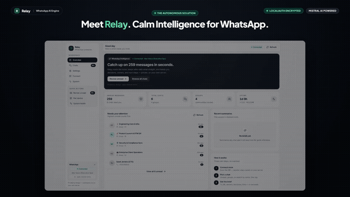
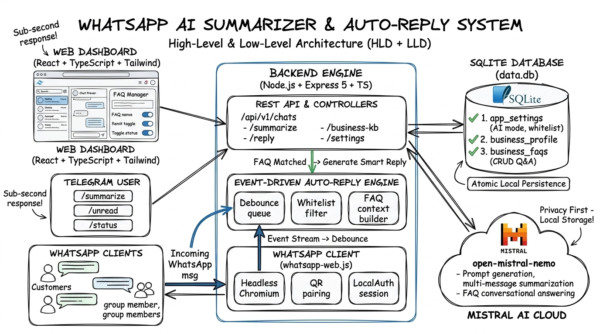

# 📱 WhatsApp Chat Summarizer

An intelligent, modular service that solves WhatsApp message overload (such as 200+ unread messages in busy groups and personal chats). It reads unread or historical conversations using `whatsapp-web.js`, summarizes them with context (senders, timestamps, reply hierarchies) using **Mistral AI models**, and provides both an interactive **Telegram Bot** UI and a standardized **REST API (v1)** with pagination.

---

## 🎬 Video Demo & Walkthrough

<p align="center">
  <a href="https://res.cloudinary.com/dukjtmdtn/video/upload/v1789400878/video_ay4oai.mp4" title="Click to play full video walkthrough">
    
  </a>
</p>

<p align="center">
  <a href="https://res.cloudinary.com/dukjtmdtn/video/upload/v1789400878/video_ay4oai.mp4">
    
  </a>
  <br/>
  <sub>🎬 <em><b>Click the preview above or the badge to play the full 1080p walkthrough video with sound (<a href="https://res.cloudinary.com/dukjtmdtn/video/upload/v1789400878/video_ay4oai.mp4"><code>Demo-Video</code></a>).</b></em></sub>
</p>

---

## 🌟 Key Features

- **Context-Aware Summarization**:
  - Distinguishes who is speaking, when, and who they are replying to.
  - Extracts **TL;DR**, **Key Topics & Discussions**, **Action Items & Assigned Tasks**, **Decisions Made**, **Important Dates & Links**, and **Urgency Ratings** (`LOW`, `MEDIUM`, `HIGH`, `CRITICAL`).
- **Interactive Telegram Bot UI**:
  - **1-Tap Inline Buttons**: View all unread chats with badges (e.g. `[ 👥 Engineering (142 unread) ]`) and tap once to summarize!
  - **Browse Active Groups & Direct Chats**: Navigate through chats with pagination (`◀️ Prev`, `Next ▶️`).
  - **On-Demand Search**: Use `/summarize <name>` for any chat.
  - **Security Whitelist**: Restricted to authorized Telegram user IDs (`ALLOWED_TELEGRAM_USER_IDS`).
  - **QR Code Delivery**: View and scan the WhatsApp pairing QR directly in Telegram via `/qr`.
- **Standardized REST API (v1)**:
  - Strict versioning under `/api/v1/`.
  - Standard response envelope: `{ success, data, pagination, timestamp }`.
  - Pagination parameters: `?page=1&limit=10`.
  - Endpoints for health, WhatsApp state, chat discovery, and on-demand summarization.
  - Built-in visual QR Code scanner at `http://localhost:3000/qr`.
- **Persistent Session**:
  - Saves credentials locally using `LocalAuth` in `.wwebjs_auth`. Scan the QR code once; subsequent restarts reconnect automatically.
- **Enterprise-Grade Architecture**:
  - Modular Clean Architecture with Dependency Inversion (`ISummarizer`, `IChatProvider`).
  - Type safety with TypeScript 7 and Zod.
  - Structured logging with Pino.

---

## 🏗️ System Architecture (HLD + LLD)

<p align="center">
  
</p>

```
       ┌─────────────────────────┐
       │   React Web Dashboard   │◄─── (Tailwind + Lucide UI + Vite)
       │  Telegram Bot (grammY)  │◄─── (/summarize, /unread, /status)
       │   WhatsApp Web Client   │◄─── (Incoming customer/group messages)
       └────────────┬────────────┘
                    │ REST API / WebSocket Events
                    ▼
       ┌─────────────────────────────────────────────────────────────┐
       │             BACKEND ENGINE (Node.js + Express 5)            │
       │                                                             │
       │  • REST API Controllers (/chats, /summarize, /reply, /kb)   │
       │  • WhatsApp Web.js Engine (Puppeteer/Chromium + LocalAuth)  │
       │  • Auto-Reply Engine (Debounced queue + Whitelist Guard)    │
       └──────────────┬──────────────────────────────┬───────────────┘
                      │                              │
         Atomic SQL   │                              │ LLM Inference
         Read / Write │                              │ Prompts & Synthesis
                      ▼                              ▼
        ┌──────────────────────────┐    ┌───────────────────────────┐
        │  SQLite Database (data.db│    │      Mistral AI Cloud     │
        │  • app_settings          │    │     (open-mistral-nemo)   │
        │  • business_profile      │    │  • Multi-message summary  │
        │  • business_faqs (CRUD)  │    │  • Contextual FAQ replies │
        └──────────────────────────┘    └───────────────────────────┘
```

---

## 🚀 Quickstart Guide

### 1. Prerequisites
- **Node.js**: v18 or higher (v24 tested)
- **Google Chrome**: Installed on your system (standard Windows path `C:\Program Files\Google\Chrome\Application\chrome.exe` is auto-detected)
- **Mistral API Key**: Free or paid key from [Mistral AI Console](https://console.mistral.ai/)
- **Telegram Bot Token**: Created via [@BotFather](https://t.me/BotFather) on Telegram

### 2. Installation
Clone the repository and install dependencies for backend and frontend:
```bash
git clone https://github.com/SreeAditya-Dev/Whatsapp_Chat_Summarizer.git
cd whatsapp_chat_summarizer

# Install Backend dependencies
cd backend
npm install

# Install Frontend dependencies
cd ../frontend
npm install
```

### 3. Configure Environment Variables
Copy `.env.example` to `.env` in the project root (or inside `backend/`):
```bash
cp .env.example .env
```

Edit `.env` with your credentials:
```ini
# Server Port
PORT=3000
NODE_ENV=development

# Database (optional, defaults to data.db)
# DATABASE_PATH=data.db

# Mistral AI (Required for summarization)
MISTRAL_API_KEY=your_mistral_api_key_here
MISTRAL_MODEL=mistral-small-latest

# Telegram Bot (Required for Telegram UI)
TELEGRAM_BOT_TOKEN=your_telegram_bot_token_here
# Your personal Telegram User ID (send /start to @userinfobot to get your numeric ID)
ALLOWED_TELEGRAM_USER_IDS=123456789

# WhatsApp Client
HEADLESS=true
DEFAULT_SUMMARY_MESSAGE_LIMIT=100
```

### 4. Run the Services

#### Run Backend (API & WhatsApp Service):
```bash
cd backend
npm run dev
```

#### Run Frontend (React Web Dashboard):
```bash
cd frontend
npm run dev
```
Open `http://localhost:5173` in your browser.

### 5. Pair WhatsApp
On the first startup, you need to pair WhatsApp:
1. **Option A (Browser)**: Open `http://localhost:3000/qr` in your browser.
2. **Option B (Telegram)**: Open your Telegram bot and type `/qr`.
3. **Option C (Terminal)**: Scan the QR printed in your terminal window.

Open WhatsApp on your phone ➔ **Settings / Linked Devices** ➔ **Link a Device** ➔ Scan the QR. Once linked, the session is saved in `.wwebjs_auth` and you won't need to scan again!

---

## 🤖 Telegram Bot Commands

| Command | Description |
| :--- | :--- |
| `/start` or `/help` | Shows the main dashboard, connection status, and quick-action buttons. |
| `/unread` | Lists chats with unread messages and displays one-click `[Summarize]` buttons. |
| `/groups` | Lists all active WhatsApp groups with pagination and summarize buttons. |
| `/chats` | Lists recent personal chats with pagination and summarize buttons. |
| `/summarize <name>` | Summarizes a specific group or personal chat by name or keyword. |
| `/qr` | Sends the current WhatsApp QR code if pairing is needed. |
| `/status` | Shows system health, uptime, memory, and WhatsApp connection state. |

---

## 🌐 REST API Documentation (v1)

All endpoints return a standardized JSON envelope:
```json
{
  "success": true,
  "data": { ... },
  "pagination": { ... },
  "timestamp": "2026-09-10T11:20:00.000Z"
}
```

### 1. Health & Status
- **`GET /api/v1/health`**
  - Returns service uptime, memory usage, WhatsApp connection status, and active AI model.
- **`GET /api/v1/whatsapp/status`**
  - Returns WhatsApp state (`DISCONNECTED`, `QR_READY`, `READY`), connected phone number, and user name.
- **`GET /api/v1/whatsapp/qr`**
  - Returns QR code string and Base64 Data URL.
- **`GET /qr`**
  - Renders an auto-refreshing visual web page for scanning the QR code in any web browser.

### 2. Chat Discovery & History
- **`GET /api/v1/chats`**
  - **Query Parameters**:
    - `page` (number, default `1`): Page number.
    - `limit` (number, default `10`, max `100`): Items per page.
    - `filter` (string, default `all`): `all` | `groups` | `direct`.
  - **Response**: Paginated list of chats with unread count and participant count.

- **`GET /api/v1/chats/unread`**
  - **Query Parameters**: `page`, `limit`.
  - **Response**: Paginated list of chats that have `unreadCount > 0`.

- **`GET /api/v1/chats/:chatId`**
  - Returns details for a specific chat.

- **`GET /api/v1/chats/:chatId/messages`**
  - **Query Parameters**: `limit` (default `50`, max `200`).
  - Returns chronological message history with sender names and quoted replies.

### 3. Summarization
- **`POST /api/v1/summarize`**
  - **Request Body**:
    ```json
    {
      "chatId": "120363045678901234@g.us",
      "messageLimit": 100,
      "model": "mistral-small-latest"
    }
    ```
  - **Response Example**:
    ```json
    {
      "success": true,
      "data": {
        "chatId": "120363045678901234@g.us",
        "chatName": "Engineering Core",
        "isGroup": true,
        "totalMessagesAnalyzed": 85,
        "timeRange": {
          "start": "2026-09-10 09:15",
          "end": "2026-09-10 16:30"
        },
        "tldr": "The engineering team finalized the v2 release schedule and resolved the staging database migration blocker.",
        "keyTopics": [
          "Database migration to PostgreSQL 16 completed in staging.",
          "Frontend UI polish for the mobile view."
        ],
        "actionItems": [
          {
            "task": "Run final load tests",
            "assignee": "Sarah",
            "dueDate": "Tomorrow 2 PM"
          }
        ],
        "decisions": [
          "Production deployment scheduled for Friday at 5:00 PM."
        ],
        "importantLinksAndDates": [
          "Staging Dashboard: https://staging.example.com",
          "Release Deadline: Sept 12, 17:00 UTC"
        ],
        "urgencyLevel": "HIGH",
        "rawSummaryMarkdown": "...",
        "generatedAt": "2026-09-10T11:25:30.000Z"
      },
      "timestamp": "2026-09-10T11:25:31.000Z"
    }
    ```

---

## 🧪 Testing

Run the automated test suite with Vitest:
```bash
npm test
```

Watch mode for development:
```bash
npm run test:watch
```

---

## 🛡️ Security & Privacy

- **Whitelisted Telegram Access**: The bot ignores any Telegram user not present in `ALLOWED_TELEGRAM_USER_IDS`.
- **Local Credential Storage**: Session data is stored strictly in your local `.wwebjs_auth/` folder and ignored by Git.
- **Data Minimization**: Only text transcripts necessary for summarization are processed. Binary media and non-text noise are skipped.

---

## 📄 License
ISC License.
